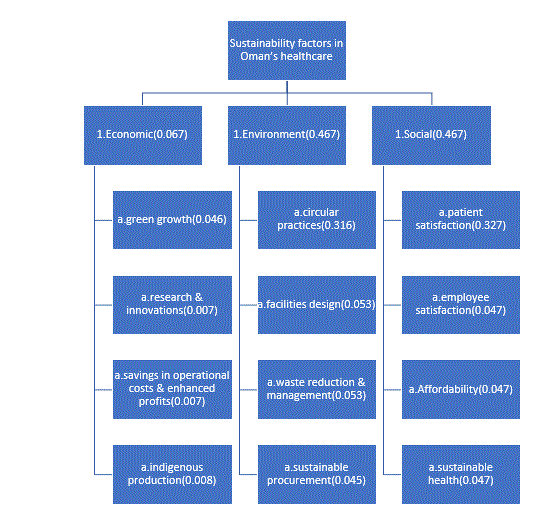

# Prioritising Sustainability Factors in Oman's Healthcare Sector (AHP)

> Which sustainability factors should Oman's healthcare sector prioritise? A multi-criteria decision analysis using the Analytic Hierarchy Process (AHP) on judgements from 23 healthcare experts.


## Problem
Healthcare organisations have limited resources and many sustainability goals competing for them. This project quantifies how experts weigh **Economic**, **Environmental** and **Social** sustainability, and the 12 sub-factors inside them, to support prioritisation.

## Data
- AHP questionnaire completed by **23 experts** in Oman's healthcare sector.
- Pairwise comparisons on Saaty's **1-9 scale**, first between the 3 main criteria, then between the 4 sub-factors inside each criterion.
- Individual judgements aggregated with the **geometric mean** to give one group matrix per level.

| Criterion | Sub-factors |
|---|---|
| Economic | green growth, research & innovation, operational cost savings & profits, indigenous production |
| Environment | circular practices, facilities design, sustainable procurement, waste reduction & management |
| Social | patient satisfaction, employee satisfaction, affordability, sustainable health |

## Methodology
1. Aggregate expert judgements (geometric mean) into group pairwise matrices.
2. Derive priority weights from the **principal eigenvector** of each matrix.
3. Check consistency with **CR = (λmax − n) / (n − 1) / RI** (threshold 0.1).
4. Multiply local weights by the parent criterion weight to get **global weights** for the 12 sub-factors.
5. Run a **sensitivity analysis** on the most influential judgement.

## Results

*Sustainability factors hierarchy with the global weight of each sub-factor.*

**Criteria weights**

| Criterion | Raw group matrix (CR = 0.41) | After consistency adjustment (CR = 0) |
|---|---|---|
| Economic | 0.052 | 0.067 |
| Environment | 0.748 | 0.467 |
| Social | 0.200 | 0.467 |

**Global weights (after adjustment)**

| Rank | Factor | Weight |
|---|---|---|
| 1 | Patient satisfaction | 0.327 |
| 2 | Circular practices | 0.316 |
| 3 | Facilities design / Waste reduction | 0.053 each |
| 5 | Employee satisfaction, affordability, sustainable health | 0.047 each |
| 8 | Green growth | 0.046 |
| 9 | Sustainable procurement | 0.045 |
| 10 | Indigenous production | 0.008 |
| 11 | R&I / Operational savings | 0.007 each |

**Key takeaways**
- **Circular practices** and **patient satisfaction** are the top two factors after adjustment (together ~64% of total weight), and both are in the top three under the raw matrices.
- **Economic** sub-factors receive very little weight in either version.
- The relative order of the top two factors depends on how the Environment-vs-Social conflict is resolved (see below).

## Consistency and robustness
All raw group matrices exceeded the acceptable threshold (CR: 0.41 criteria, 0.43 Economic, 0.30 Environment, 0.42 Social with Saaty's RI; the source report obtains similar values with RI = 0.52 / 0.89). A transitivity adjustment was applied to obtain consistent matrices.

The main-level inconsistency comes almost entirely from **one judgement**: experts rated Environment ≈ 7× more important than Social, yet both were rated ≈ 7× more important than Economic, which implies Environment ≈ Social.

| Environment over Social | Economic | Environment | Social | CR |
|---|---|---|---|---|
| 1 (adjusted) | 0.064 | 0.465 | 0.471 | 0.00 |
| 3 | 0.060 | 0.632 | 0.308 | 0.13 |
| 5 | 0.056 | 0.701 | 0.243 | 0.27 |
| 7.39 (raw) | 0.052 | 0.748 | 0.200 | 0.41 |

Conclusions about **Economic being lowest** are stable across this range; conclusions about **Environment vs Social** are not, and should be read with that in mind.

## Limitations and next steps
- Individual expert matrices are not included, so per-expert consistency (CR / GCI) and expert-level outlier checks are not shown here.
- Judgements cluster near the top of the 1-9 scale, which pushes matrices toward inconsistency (scale saturation).
- Planned: compare aggregation of individual judgements vs. priorities, add Monte Carlo weight perturbation, and consider alternatives such as fuzzy AHP or BWM.

## Repository structure
```
├── README.md
├── Measuring sustainability factors in oman.docx (3) (1).pdf   # full project description
├── goal 3.jpg              # AHP hierarchy with final weights
├── results/                 # weights and sensitivity tables (CSV)
└── images/                  # figures used in this README
```

## Tools
- [SpiceLogic AHP Software](https://spicelogic.com/products/ahp-software-30)
- [AHP Online System (AHP-OS)](https://bpmsg.com/ahp/)
